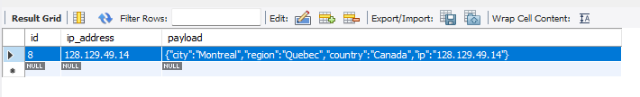

# IpInfo API

A simple Spring Boot application that fetches geolocation data for IP addresses using the ipinfo.io API, stores it in a MySQL database, and retrieves it via REST endpoints. Built for a DevOps-focused coding exercise, this project emphasizes minimalism, reliability, and ease of deployment with Docker and Maven.

## Features

- **POST /Ip/Add**: Fetches geolocation data for a given IP address from ipinfo.io and stores it in MySQL.
- **GET /Ip/Get**: Retrieves stored geolocation data for a given IP address as JSON.
- No IP validation, storing raw JSON payloads, as per requirements.
- Dockerized for consistent deployment.
- Comprehensive tests with MockMvc and real MySQL integration.

## Tech Stack

- **Backend**: Spring Boot 3.4.4, Java 17
- **Database**: MySQL (local Workbench for tests, Docker for app)
- **Build**: Maven
- **Dependencies**: Spring Web, Spring Data JPA, MySQL Connector, Lombok, Spring Test

## Prerequisites

- **Java 17**: Ensure JDK 17 is installed (`java -version`).
- **Maven**: For building and testing (`mvn -version`).
- **Docker**: For running the app (`docker --version`).
- **MySQL Workbench**: For local test database (optional, version 8.0+ recommended).
- **Internet Access**: For ipinfo.io API calls during runtime.

## Setup

### 1. Clone the Repository
```bash
git clone <repository-url>
cd ipinfo
```

### 2. Test Coverage
The project has six tests in IpInfoApplicationTest.java, using MockMvc and a real MySQL database to validate the API:

* contextLoads: Checks the Spring Boot app loads, ensuring beans like IpController and IpInfoRepository are ready.

* testPostIpAdd_Success: Tests POST /Ip/Add with IP 128.129.49.14, mocks ipinfo.io, expects HTTP 201, and verifies IP and JSON payload are saved in ip_info.

* testPostIpAdd_MissingIpAddress: Tests POST /Ip/Add without an IP, expects HTTP 400 and "IP address is required".

* testGetIp_Success: Tests GET /Ip/Get with a stored IP 128.129.49.14, saves test data, expects HTTP 200, and checks returned JSON matches the payload.

* testGetIp_NotFound: Tests GET /Ip/Get with unknown IP 1.1.1.1, expects HTTP 404 and "No data found" message.

* testGetIp_MissingIpAddress: Tests GET /Ip/Get without an IP, expects HTTP 400 and "IP address is required".

#### Run tests:
```bash
mvn test
```
#### Check test data:
```bash
mysql -h localhost -u admin -padmin ipinfo_db -e "SELECT * FROM ip_info"
```

